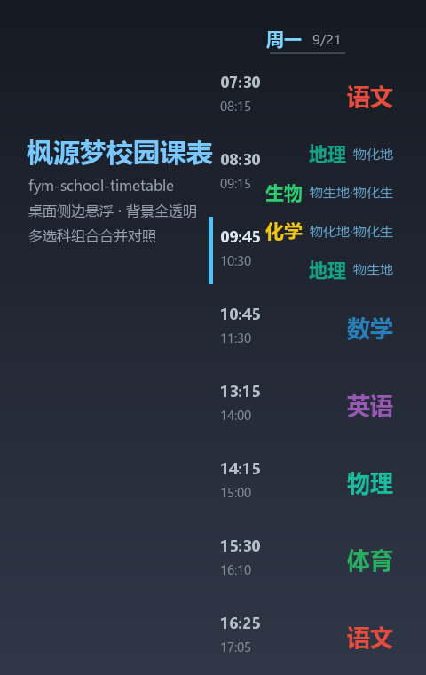
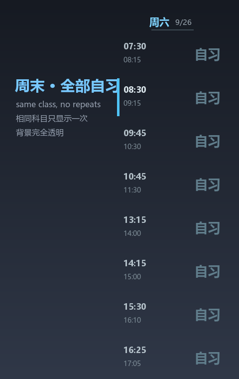

# 枫源梦校园课表 (fym-school-timetable)

一个贴在 Windows 桌面**屏幕右侧**的悬浮课程表小工具。背景**完全透明**，只用文字颜色区分科目；支持多个**选科组合**合并对照显示、开机自启、全屏自动隐藏。



## 功能特性

- **侧边悬浮**：固定在屏幕右侧，不占任务栏、不显示在 Alt+Tab 中
- **背景全透明**：没有底色和边框，只有彩色文字（使用逐像素 alpha 的分层窗口，文字边缘平滑、无描边）
- **科目分色**：每个科目一种颜色，可在设置页自由修改
- **多选科组合**：支持「物化地 / 物生地 / 物化生」等组合；**合并模式**下同一节课只显示一次，组合不同时才分行标注（例：`地理 物化地` / `生物 物生地·物化生`）
- **当前课时高亮**：正在上的那一节，左侧有青色竖条标记
- **全屏自动隐藏**：看视频 / 玩游戏全屏时自动隐藏，退出全屏自动恢复
- **开机自启**：可开关（写入注册表 `HKCU\...\Run`）
- **设置页**：快捷键 **Win + Shift + F**，或双击 / 右键悬浮窗打开
- **轻量**：常驻内存约 50 MB

## 截图

| 工作日（多组合对照） | 周末（全部自习） |
| --- | --- |
|  |  |

## 运行环境

- Windows 10 / 11
- Python 3.9+（从源码运行）
- 依赖：`Pillow`、`pynput`

## 快速开始

### 方式一：直接使用打包好的 EXE

下载 `release` 里的压缩包，解压后双击 `枫源梦校园课表.exe`。

> 首次运行会自动写入开机自启（可在设置页关闭）。

### 方式二：从源码运行

```bash
pip install -r requirements.txt
python main.py
```

### 打包成 EXE

```bash
pip install pyinstaller
python build.py
```

产物在 `dist/枫源梦校园课表/`。

## 使用说明

| 操作 | 说明 |
| --- | --- |
| 打开设置 | `Win + Shift + F`，或双击悬浮窗，或右键悬浮窗 → 设置 |
| 关闭软件 | 右键悬浮窗 → 退出 |
| 修改课表 | 设置页 →「课程表」页，选择组合与星期，增删改每节课 |
| 修改颜色 | 设置页 →「科目颜色」页，双击科目改色 |
| 合并 / 纯文字模式 | 设置页 →「常规」页 |

配置文件保存在：

```
%APPDATA%\枫源梦校园课表\config.json
```

## 项目结构

```
main.py         主程序（窗口、渲染、热键、设置页）
build.py        PyInstaller 打包脚本
installer.py    自解压安装包生成脚本（可选）
assets/app.ico  程序图标
requirements.txt
```

## 实现要点

- 界面：`tkinter`（无边框置顶窗口）
- **透明渲染**：`WS_EX_LAYERED` + `UpdateLayeredWindow`，配合 Pillow 渲染 RGBA 位图，实现真正的逐像素透明（相比 `-transparentcolor` 色键透明，文字抗锯齿边缘不会出现黑/绿描边）
- 全局热键：`pynput.keyboard`
- 全屏检测：`GetForegroundWindow` + 窗口矩形与显示器比对
- 打包：`PyInstaller`（onedir）

## 说明

仓库内的默认课表为**示例数据**，仅用于演示。请通过设置页填写自己的课表。

## License

[MIT](LICENSE) © 2026 枫源梦
